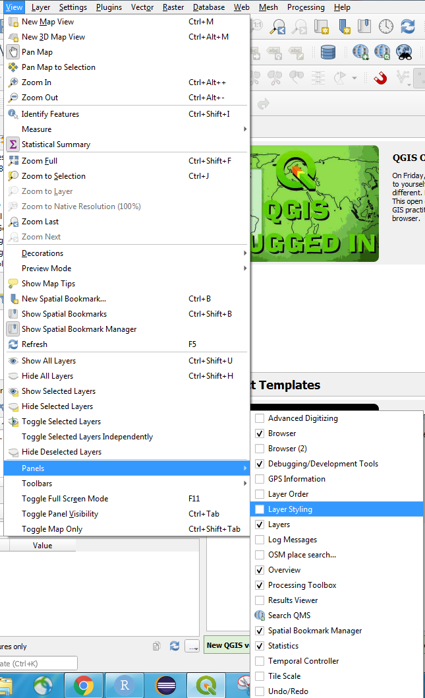
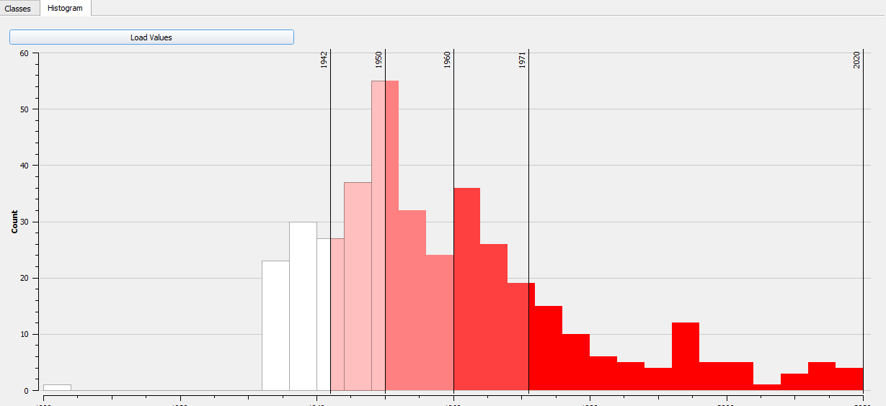
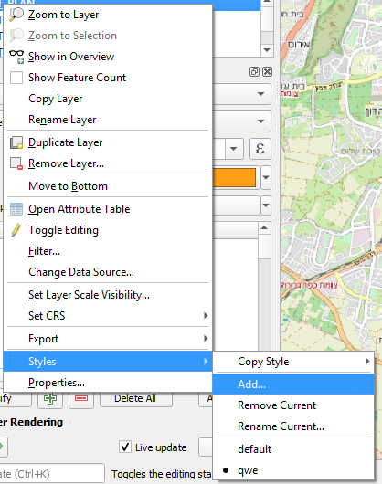
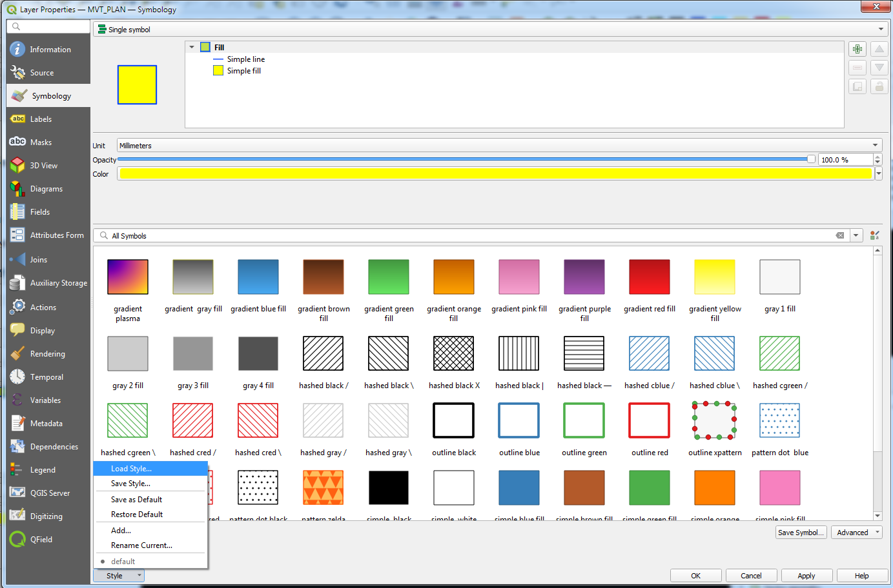

## סוגי ייצוג של ישויות

לפני שמתחילים לייצג תופעה מרחבית, נשאל את עצמנו שתי שאלות בסיסיות:

1.  מהו אופי המשתנה המיוצג?

2.  מהו אופי הייצוג?

## אופי המשתנה

-   נומינלי(שמות, מין) - אין חשיבות לסדר
-   אורדינלי(רמות הכנסה, השכלה) - יש חשיבות לסדר, אין רציפות
-   אינטרבלי(טמפרטורה) - יש חשיבות לסדר, יש רציפות, אין יחסיות
-   יחסי(נפחי תנועה) - יש חשיבות לסדר, יש רציפות, יש יחסיות

## אופי הייצוג

-   צבע

    ```{r echo=FALSE, message=FALSE, warning=FALSE}
    library(tidyverse)
    library(sf)
    library(ggpattern)
    nc <- st_read(system.file("shape/nc.shp", package="sf"),quiet = TRUE)
    nc %>% 
      st_centroid() %>% 
      ggplot(aes(color = SID79)) + 
      geom_sf()
    ```

-   גודל

```{r echo=FALSE, message=FALSE, warning=FALSE}
nc %>% 
  st_centroid() %>% 
  ggplot(aes(size = SID79)) + 
  geom_sf()
```

-   צורה

```{r echo=FALSE, message=FALSE, warning=FALSE}
nc %>% 
  st_centroid() %>% 
  ggplot(aes(shape = factor(floor(SID74/8)))) + 
  geom_sf()
```

-   מילוי

```{r echo=FALSE, message=FALSE, warning=FALSE}
nc %>% 
  ggplot(aes(pattern =  factor(floor(SID74/8)))) + 
  geom_sf_pattern()
```

-   שקיפות

```{r echo=FALSE, message=FALSE, warning=FALSE}
nc %>% 
  st_centroid() %>% 
  ggplot(aes(alpha = factor(floor(SID74/8)))) + 
  geom_sf()
```

-   מרקם קו

```{r echo=FALSE, message=FALSE, warning=FALSE}
nc %>% 
  ggplot(aes(linetype =factor(floor(SID74/8)))) + 
  geom_sf()
```

## בqgis

שתי דרכי גישה אל פאנל העיצוב:

דרך פאנל {width="400"}


בחלון נפרד

## סימול אחיד

התוכנה מאפשרת לנו לבצע סימולים אחידים עבור כל השכבה. במידה ואנחנו לא רוצים להיכנס לפרטים, ניתן לעשות קוסטימיזציה למאפיינים בסיסיים כמו גודל, צבע, שקיפות וזווית. ניתן גם לבחור סגנון קבוע מראש.

## סימול מורכב יותר

במידה ולוחצים על simple marker, אפשר לשפר את השליטה בסימון הנקודה.


יש הרבה מאוד אפשרויות סגנון, ניתן להעלות סוגים שונים של מרקרים מתמונות וכו'. מדובר בעולם תוכן שלם, ולא ניגע בו בקורס זה, שכן הוא כולל הרבה מאוד למידה עצמית, והוא מאוד תלוי למה שרוצים להשיג.

## סימול לפי קטגוריות

נשנה את הבחירה בדרופדאון העליון לcategorized


השליטה הבסיסית כאן היא:

על בסיס איזה משתנה מחלקים לקטגוריות. qgis מציין אם המשתנה הוא מספרי או טקסטואלי, ובכך מסייע בבחירה (ניתן להשתמש בביטויים, ועל כך בהמשך הקורס)

הפיכת הסימול למורכב יותר, בדומה לסימול אחיד

רמפת צבעים


שימו לב! תמיד יש ללחוץ על כפתור הclassify על מנת לחלק לרמות השונות


ניתן להוסיף או להחסיר קטגוריות על בלחיצה על + או -, לשנות את שם התגית שתוצג בחלונית השכבות ובמקרא המפה.

## סימול לפי משתנה רציף - אוטומטי

דומה מאוד לסימון לפי משתנה קטגוריאלי, בשינוי משמעותי אחד - השליטה בחלוקה לרמות. ניתן לבצע אותה בצורה אוטומטית או ידנית:

בצורה אוטומטית, יש ללחוץ על תפריט mode (לאחר שבחרנו את המשתנה ולחצנו על classify), ולבחור את צורת החלוקה בין הנתונים.


## אפשרויות חלוקת דאטה:

1.  x-ונים - כמות שווה של דגימות בכל קבוצה (חציונים, רביעונים, חמישונים, עשירונים וכו')

2.  מרווח שווה בין הערכים (נניח שסט הערכים בין 0 ל10, ואנו מחלקים בחמש, החלוקות יהיו במספרים הזוגיים)

3.  סקאלה לוגרתמית - חלוקה שווה בין החזקות הלוגרתמיות

4.  הפסקות טבעיות - מבוססות אלגורתם jenks (ממזער שונות בתוך הקבוצה, ממקסם שונות בין הקבוצות)

5.  הפסקות יפות - מבוססות עיגול ערכים

6.  חלוקה מבוססת מיקום הדגימה בהתחשב מהסטייה של הנתון מהממוצע

כפתור הclasses מאפשר לנו לחלק את הדאטה לכמות הרמות הרצויה.

שימוש בhistogram מאפשר לנו לראות כיצד הדאטה מתפלג, ומסייע בהבנה של איך יהיה חכם לייצג אותו בצורה לא מרחבית. ניתן אף להוסיף רמות על ידי לחיצה על המקום בהיסטוגרמה בו רוצים להוסיף, או לשנות גבולות על ידי הזזת הקווים על ההיסטוגרמה. (לא לשכוח ללחוץ על load values בהתחלה)

## סימול לפי משתנה רציף - ידני

ניתן גם לחלק לרמות שונות בצורה ידנית - בחירת המשתנה, הוספת רמות באמצעות לחיצה על כפתור הפלוס, בחירה הרמה הרצויה, ודאבל קליק על עמודת הvalues. שם יש לציין גבול תחתון ועליון לרמת הייצוג. במידה ויש כמה רמות, הגבולות בין הרמה לרמות האחרות ישתנו בהתאם לשינוי שמבצעים ברמה. יש לבחור צבעים לכל רמה על ידי דאבל קליק על עמודת symbol,וגם לשנות את התגית של הקבוצה על ידי דאבל קליק על השדה בעמודת legend.

## assistant

פעמים רבות, בייצוג גדלים אבל לא רק, נוכל לעשות שימוש במשתנים שונים על מנת לייצג מימדים נוספים של המשתנה. שימוש בדיאלוג של assistant יכול לעזור בבחירת המשתנה הרלוונטי


## זה לא נגמר כאן....

סימבולוגיה היא עולם שלם ומופלא. למדנו עכשיו רק את הבסיס שלו, שמספיק ל80% מהמקרים. ב20% האחרים יש להיכנס יותר עמוק לqgis, לסמן לפי חוקים, מפות חום, שניים וחצי מימדים, גודל וכו'

הלימוד העצמי כאן חשוב מאוד, וישנם מקורות רבים באינטרנט בהם ניתן להיעזר

## תרגיל ראשון:

1.  פתחו את הפרויקט מהגאופקג' של השיעור הראשון

2.  ייצגו את המבנים בת"א לפני שנת הבנייה

3.  יצגו את בתי הספר במפה לפי הישוב בהם הם נמצאים

4.  שמרו על השינויים בפרויקט

5.  פתחו פרויקט חדש, וטענו שוב את הפרויקט

## תגיות

לעיתים נרצה לייצג את הישויות שלנו בצורה טקסטואלית על גבי המפה. נלך לטאב הlabels בproperties של השכבה. לרוב נרצה את single lables


ניתן לקבוע ערכים רבים לגבי הטקסט - המשמעותי ביותר היא העמודה או הביטוי שמייצג אותו (value). ניתן לשלוט בגודל הפונט, בסוג שלו בשקיפות וכו'. בתפריט בצד ניתן לראות עוד אפשרויות - צבע מסביב לטקסט, טקסט רומס או לא רומס, וכו'. אין כאן המקום להאריך, בעיקר מציע לשחק או לגגל. 

## גלגל ההצלה האולטימטיבי - היסטוריה של סגנונות!

קורה שמייצרים סגנון חדש לשכבה, אבל מתחרטים ולא זוכרים מה היה בסגנון הקודם.

ניתן לעקוב אחרי ההיסטוריה של הסגנונות בפאנל:

## סגנון משתחזר

לפעמים נרצה לשחזר סגנון בצורה מדויקת, בין אם זה בתוך אותה שכבה, או בין אם זה בין שכבות שונות.

## שמירה על סגנונות מרובים באותה השכבה



ושיום של הסגנון. לאחר מכן נוכל לשנות לייצר סגנון חדש, לשיים אותו, ולבחור בין השניים לפי הצורך.

## העתקת סגנון משכבה לשכבה

ניתן ללחוץ על שכבה ולהעתיק ממנה את הסגנון:


ולאחר מכן, להעביר את הסגנון לשכבה שמכילה את אותם הנתונים עם paste style, שיווצר מתחת לcopy style

## תרגיל שני:

1.  טענו את פרויקט mavat מהגאופקג' mavat

2.  שמרו על הסגנון של שכבת rehovot east

3.  העתיקו את הסגנון של שכבת mavat_plan

4.  העבירו אותו אל שכבת rehovot east

5.  שמרו על הסגנון החדש

6.  העבירו בין שני הסגנונות

## טעינת ושמירת סגנון מקובץ/לקובץ

פעמים רבות נעבוד עם דאטה שיש לו פורמט אחוד, או שיש לנו הרבה שכבות באותו פורמט. ולכן, עיצוב אחיד שנטען משכבה אחרת במקרים אלו יכול מאוד לעזור.

קבצי qml וsld יכולים לעזור לנו בסוגיה זו.

שניהם קבצים ממשפחת xml, אך בעוד sld תואם לפורמט הכללי כפי שנקבע על ידי הogc, qml מותאם ספציפית לqgis.

ככה נראה qml מבפנים

הוא למעשה מגדיר בצורה מדוקדקת את הייצוג של כל אחד מהשדות.

בשביל להעביר בצורה יותר קלה בין פלטפורמות, כדאי להשתמש בsld, אבל qml מאפשר גמישות נוספת בהגדרות של עיצוב לפי מנוע הביטויים, בו בתקווה ניגע בהמשך הקורס.

## טעינת ושמירת סגנון מקובץ/לקובץ - 2



שם יש צורך לבחור טעינה מקובץ, שמירה על כל הקטגוריות, ובחירה בקובץ הsld או הqml.

באותה צורה ניתן גם לשמור סגנון, כsld,כqml או בתוך הגאופקג' (וארחיב קצת בהמשך)

[לינק חשוב מאוד - סגנונות mavat לqgis](https://www.gov.il/he/departments/general/symbology_qgis)

## תרגיל שלישי:

1.  פתחו את פרויקט mavat_no_symbology מהגאופקג'mavat.

2.  החליפו את הסימבולוגיה של השכבות לסימבולוגית mavat סטנדרטית, באמצעות הקבצים מהקישור, או במידה ואתם בוחרים בקבצים בתיקייה.

## טעינת ושמירת סגנון מgpkg

חשוב לדעת שניתן לשמור את הסגנונות שיש לנו ישירות אל תוך הgpkg,ולא לקובץ נפרד, ככה שנדע לנהל אותם בצורה של אי ריבוי קבצים, ולייצא החוצה במידה הצורך, אם רוצים להעביר לפרויקט אחר. הסגנונות נשמרים מחוץ לפרויקט, וגם אם עובדים עם גאופקג' נטול פרויקט, הם יטענו כמות שהם. חבל שמינהל התכנון לא מפרסם את כל קצבי הmavat כגאופקג'.

## המלצה ארגונית חמה

בבהתים עתידיים, או בפרויקטים משתחזרים אחרים, לייצר סגנונות ארגוניים קבועים לשכבות מסוימות. ברוב המקרים הם יתאימו. לעיתים תצטרכו לעשות קצת התאמות, אבל יהיה לכם בייסליין קל.

## יצירת מפות

מלאכה יחסית טכנית. לוקחת את הסימבולוגיה ושכבות הרקע, ושמה אותם עם אלמנטים נוספים של המפה.


יצירת המפה מבקשת קריאה בשם של הlayout של המפה, ולאחר מתן השם פותחת חלון חדש.


## הוספת מפה לlayout

בסרגל בצד ימין ניתן לראות את האלמנטים שניתן להוסיף לlayout

הוספת המפה מציגה את מה שנמצא בcanvas של qgis ברגע הזה. ניתן לשנות את מה שהמפה מראה על ידי לחיצה על 

שימו לב שבשביל זום אין/אאוט, המפה צריכה להיות בחורה בitems panel

## אלמנטים נוספים

בגדול העבודה מזכירה מאוד עבודה עם פאוור פוינט. מאפשרת הוספת אלמנטים מסוימים.

השליטה באופי האלמנטים מזכירה את חלונית הפורמט מאופיס - נקראת בשם item properties

בתפריטים השונים כאן ניתן לשחק עם המאפיינים השונים של כל אלמנט.

חשוב להכיר את אלמנט המקרא - הוא למעשה מבאר מה שמייצגים הסמלים השונים במפה. 

חשוב להיות רלוונטיים! להראות רק את האלמנטים שנמצאים בשכבות שניתן לראות במפה, או כאלה בעלי משמעות לקורא.

במידה ורוצים להעלים חלק מהשכבות מהמקרא, ניתן לעשות זאת על ידי בחירת המקרא בפאנל הitems, פתיחת חלונית item properties, ויתור על הטיק בauto update, וגריעת כל השכבות המיותרות על ידי בחירתן ולחיצה על מינוס. 

משחקים עם האינדטציה (חשוב במיוחד לאור הכתיבה בעברית) ניתן לעשות בחלונית הזאת


אלמנטים נוספים "מפתיים" הם חץ צפון, קנה מידה, וסרגל קנה מידה.

## ייצוא המפה

ניתן להדפיס את המפה, או לייצא אותה לpng,svg או pdf


## ניהול מפות שונות באותו הפרויקט

layout manager

מאפשר גישה לכל המפות בפרויקט, יצירה של אחת חדשה, או טעינת טמפלייט קיים עבור מפה.

ניתן לייצר טמפליטים על מנת להימנע מסידור האלמנטים במפה כל פעם מחדש.

## אטלס

דרך לעשות אוטומציה למפות גדולות, שכנראה צריכות להיות בקנה מידה גדול במיוחד, ולכן מפצלים אותן לכמה עמודים.


יש לאפשר את יצירת האטלס, לכתוב איזו שכבה אנו מעוניינים שתפריד בין העמודים, ולמצוא משתנה שיתן את מספר העמוד.

בחזרה לitem properties של המפה, יש להגדיר שהמפה נשלטת על ידי אטלס, ולבחור באופציה כפי שבתמונה


לבסוף, ללחוץ כאן


הכפתורים ליד preview atlas יהפכו לזמינים, ויהיה ניתן לדפדף באטלס שיצרתם.

ניתן לייצא את האטלס לכמה פורמטים שונים


דוגמא לפלט:


וכו'.

תוספת רלוונטית מאוד:

[יצירת שתי מפות, אחת overview עם כל חלקי המפה, ובשניה החלק הרלוונטי](https://gis.stackexchange.com/questions/319599/how-to-create-an-index-map-of-atlas-features-in-qgis-3)

## תרגיל בית:

יצרו מפה של אחד הפרויקטים שאתם עובדים עליו עכשיו. אל תפחדו להתנסות בatlas, במידה ויש צורך בכך.

אנא קחו אלמנט חדש שלמדתם בשיעור, ותסביר כיצה הוא רלוונטי במפה/סימובולוגיה שיצרתם.

בתחילת השיעור הבא כל אחד יציג בשתי דקות את המפה שלו. אשמח אם תוכלו לשלוח לי למייל בidshklein\@gmail.com את המפות שלכם, על מנת שנוכל להציג אותן ולדון בהן בקצרה.

<link href="my-style.css" rel="stylesheet">
