## הקדמה

לרוב מתכנני תחבורה יקבלו מידע מוכן מראש, ועליו יבצעו ניתוחים כאלה ואחרים. לעיתים בעבודה עם qgis נצטרך לערוך שכבות, כתלות בסוג העבודה. נדון בעריכת שכבות (הן בהוספת מידע והן בדיגיטציה) בשיעור הבא. נדון יותר לעומק בעריכה ובדיגיטציה. בשיעור זה נתמקד בעבודה בסיסית עם מידע.

## טבלת ישויות

כפתור ימני ו

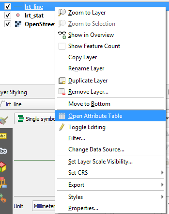

נקבל טבלה סטנדרטית, נתעכב בקצרה על חמישה אלמנטים:

### הכותרת

שם השכבה, סך הישויות, ישויות שפולטרו, ישויות שנבחרו

### השורה

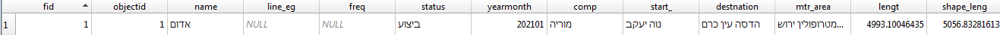

לחיצה על החלק המספר האפור משמאל תוביל לבחירת הישויות

לחיצה על כפתור ימני על אחד מתאי השורה תוביל לדיאלוג הבא

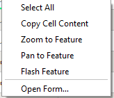

כל המתודות שקשורות לfeature מאוד עוזרות בהתמקדות על ישויות מסוימות.

כמובן שלחיצה על ראשי העמודות תסדר את השורות בסדר עולה או יורד, על פי שם העמודה שלחצתם עליה.

### סרגל הכלים

לסרגל הכלים יכולות רבות מאוד.

ניתן באמצעות לפתוח את השכבה לעריכה (נדבר על עריכה בשיעור הבא) ולשלוט בחלק מהיבטי העריכה באמצעות הסרגל.

ניתן לבצע שאילתא טבלאית או פילטר מסוגים רבים

ניתן להוסיף שדות או עמודות

ניתן לעשות עיצוב מותנה

ניתן לעגן את הטבלה

### פינה ימנית תחתונה

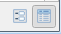

מעבר ממבט טבלה למבט טופס, ולהיפך. מבט טופס אינו נוח כל כך אבל לפעמים הוא מועיל.

### פינה שמאלית תחתונה

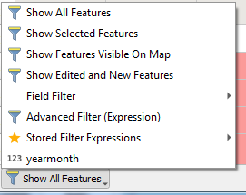

תפריט נוסף המאפשר צפייה בישויות לפי מצבן הנוכחי.

## בחירה ידנית

למדנו לבצע בחירה ידנית בטבלה על ידי לחיצה על השורה. ניתן לבחור ישויות גם באמצעות בחירתן על גבי המפה באמצעות פאנל הבחירה

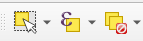

הכפתור השמאלי מאפשר את הבחירה באמצעות לחיצה על ישויות.

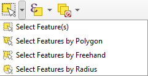

ניתן גם לסרטט פוליגון, או צורה חופשית, או רדיוס, על מנת לבצע בחירה על גבי המפה.

טיפ של אלופים:

החזיקו את shift או ctrl על מנת להוסיף או להחסיר ישויות מהבחירה

על הכפתור האמצעי נדבר בהמשך

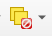

מבטל את כל הישויות הנבחרות (ניתן לשנות לשכבה האקטיבית הנוכחית או לכל השכבות)

## תרגיל ראשון: בחירה

בצעו 3 בחירות:

קו הרק"ל של חוצה ישראל

תחנת הרקל הקרובה ביותר למשרדי אמאב

כל תחנות הרקל התחתיות

## שאילתא טבלאית

נחזור לכפתור האמצעי בפאנל הבחירה.

שתי אפשרויות: בחירה לפי ביטויים ולפי ערכים. בחירה לפי ביטויים היא קצת מורכבת, ואולי נתעכב עליה בהמשך הקורס. נתמקד בבחירה לפי ערכים.

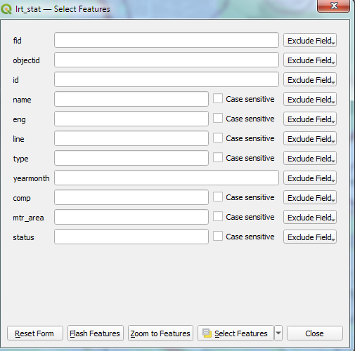

בדיאלוג ניתן לראות את שדות הטבלה. בצד ימין - דרופדאון שמאפשר לנו לבחור את היחס בין הערך הטבלאי לערך אותו נציין. בלבן נזין את הערך, במידה ומדובר בטקסט תהיה השלמה אוטומטית.

היחסים של ערך מספרי:

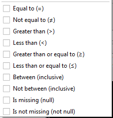

היחסים של ערך טקסטואלי:

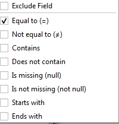

על מנת לבחור, נלחץ על select features. ניתן גם לייצר בחירות מסוגים אחרים.

## שאילתא מרחבית

מכיוון שאנחנו מתעסקים עם מרחב, נרצה לדעת לבחור ישויות בהתאם ליחס שלהן לישויות מרחביות אחרות, ולא רק לערכים שלהן.

אחזור על המנטרה - אנחנו ממשיכים להתעסק עם עמודת המרחב, רק שהפעולה אותה אנחנו מבצעים מולה היא השוואה מסוגים מסוים, עבור ישויות מוגדרות מראש.

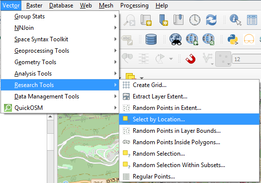

ניתן לגשת גם מהprocessing toolbox

ההשואה תתבצע בין כל הישויות בשכבה אחת, אל מול ישויות אחרות - בין אם אלו ישויות בשכבה אחרת, ובין אם אלו ישויות שנבחרו באותה השכבה.

## יחסים מרחבים: 

יש הרבה מאוד סוגים של יחסים בין כל צמד ישויות מרחביות שנמצאות במרחב דו מימדי. 512 ליתר דיוק. [קריאה נוספת מומלצת](https://en.wikipedia.org/wiki/DE-9IM)

היחסים הנפוצים הם הצטלבות, הכלה, נגיעה, חפיפה, חצייה.

לא נרחיב כאן את היריעה, מכיוון שהצטלבות, שהיא ברירת המחדל, היא רוב מה שנצטרך.

ניתן להרחיב את היריעה כאן בקריאה הנוספת המומלצת. ניתן גם לראות הסבר קצר במדריך של [postgis](https://postgis.net/workshops/postgis-intro/spatial_relationships.html)

## תרגיל שני: שאילתות

בצעו 3 שאילתות:

בחרו את כל תחנות הרק"ל התחתיות

בחרו את כל תחנות הרק"ל בקווים שצבעם אדום

בחרו את כל קווי הרקל שעוברים בתחנת החאן (השתמשו בשכבת station buffer)

## פונקציות טבלאיות

QGIS מאפשר מספר פונקציות של סיכום או עיבוד לטבלה כולה, על מנת להפיק מדדים כמו ממוצע, חציון, סכום, סטיית תקן וכו'.

### סטטיסטיקה בסיסית

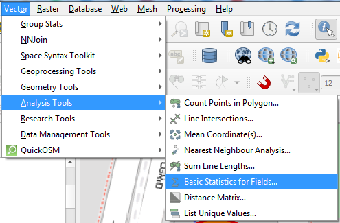

בחירת שכבת ושדה מהשכבה:

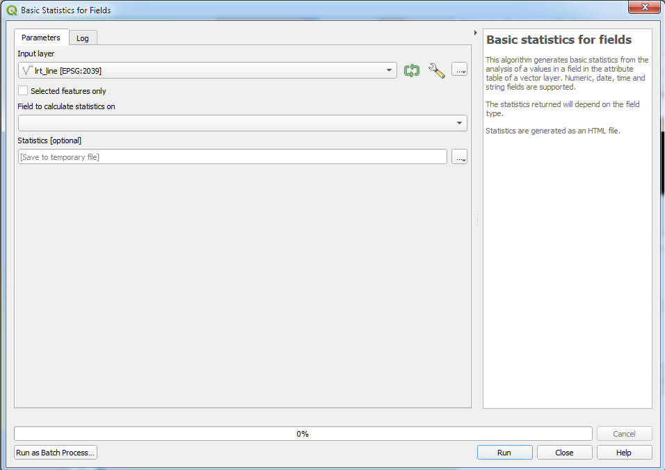

תוצאות חוזרות בלוג או בקובץ HTML בפאנל RESULTS

### ערכים ייחודיים

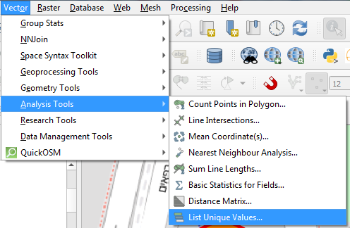

נפתח דיאלוג דומה לקודם, יש לבחור את השכבה ואת השדה שרוצים לדעת עבורו את הערכים המיוחדים. הםלט מחזיר את מספר הערכים ואת ערכם.

## פאנל סטטיסטיקה

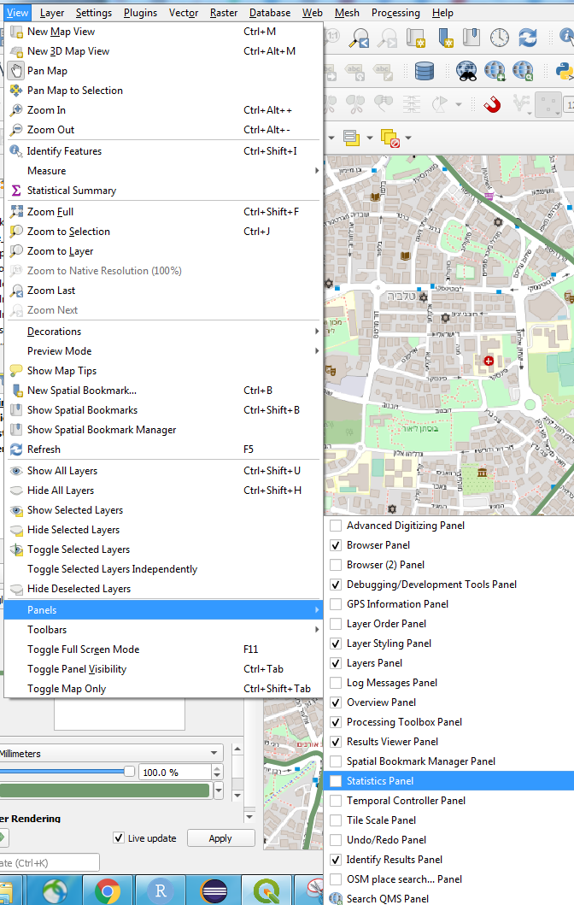

פאנל הסטטיסטיקה נותן ערכים בסיסיים, בדומה לפונקצית basic statistics for fields.

## תוסף group stats (הדגמה בלבד)

תוסף group stats מאפשר הרצה של פיבוטים בתוך qgis. הוא יחסית נוח לשימוש, אבל יצוא המידע הוא לcsv בלבד, ומורכב לעשות איתו עבודה סטטיסטית.

ההדגמה: כמה תחנות רק"ל יש בכל צבע קו בכל מטרופולין?

## לעיתים אין מנוס מאקסל. אבל זה רק אם לא יודעים sql (שוב, הדגמה בלבד)

פיבוטים הן למעשה פישוט של שאילתות sql. ניתן לבצע שאילתות פשוטות על טבלאות שיתנו לנו תשובות דומות. היתרון העצום בשאילתות זה היכולת לשחזר אותן, לגלות טעויות בשאילתא, ולשנות את השאילתא כך שבקלות רבה תתן לנו עוד ניתוחים.

חזרה על ההדגמה

## תרגיל שלישי: פונקציות טבלאיות

ענו על השאלות הבאות:

כמה חברות שונות לפיתוח קווי רק"ל יש? מה שמותן?

מהו הסטטוס הנפוץ ביותר של פיתוח קווי רקל?

כמה תחנות רק"ל יש בקווים שצבעם חום? (היעזרו בבחירה, בצעו באמצעות הפונקציות)

## גאומטריה חישובית על קצה המזלג

עד כה, הדגמנו שאילתות או ניתוחים שלוקחים בחשבון בעיקר את העמודות הלא מרחביות בטבלה (למעט בבחירה לפי מיקום).

כעת, נרצה למנף את הכוח של מערכות המידע הגיאוגרפיות, ולבצע ניתוחים מורכבים יותר, שמתאפשרים לנו על ידי גאומטריה חישובית.

כשאני אומר גאומטריה חישובית, אני מתכוון לסט הפונקציות המתמטיות החישוביות שניתן לבצע על סט גאומטריות על מנת לבצע ניתוחים מרחביים. [להרחבה](https://en.wikipedia.org/wiki/Computational_geometry)

תחום זה הוא למעשה התורם המרכזי של ביצוע פעולות gisיות.

## פונקציות מרחביות בסיסיות

### הצלבה

יצירת סט ישויות חדשות, המבוססות על שתי שכבות קלט. האלוגריתם לוקח את הגאומטריה המשותפת בין כל שתי ישויות מהשכבות השונות, ומחזיר את התוצאות בשכבה חדשה.

חשוב מאוד לציין - במידה ויש לנו ישויות מסוגים שונים(נקודות קווים פוליגונים) - יוחזרו תוצאות מהשכבה הנחותה יותר (למשל - נקודה וקו - נקודה, קו ופוליגון - קו).

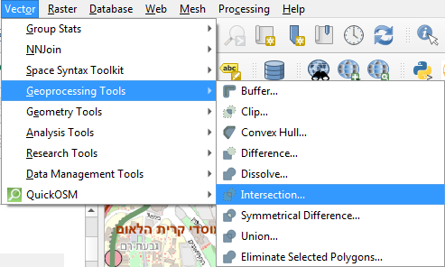

שכבת האינפוט תמיד תהיה מהזן הנחות יותר, שכבת הoverlay - מהזן היותר גבוה.

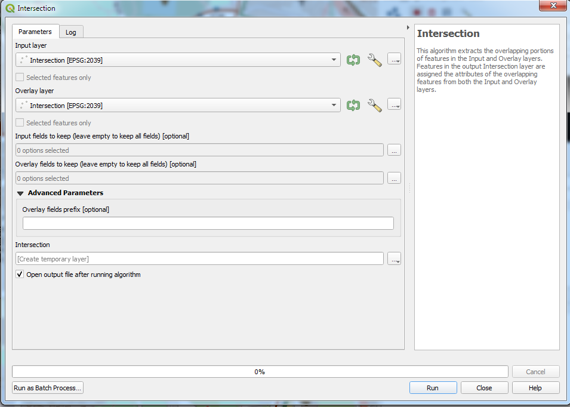

### חיץ

מרחיב את הישות ומוסיף לה חיץ מסביבה. בהגדרה הופך את השכבה לפוליגונלית.

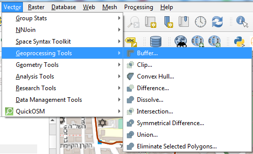

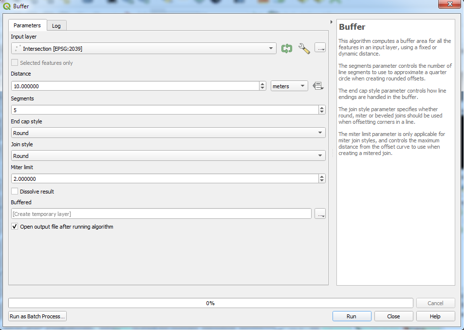

בעיקר - בחירת השכבה וציון המרחק, לפי יחידות המידה. יש לשים לב - יעבוד רק עם שכבות שהומרו לרשת מוטלת, כמו ישראל חדשה ודומותיה. כל יתר הפרמטרים הם של אופי ההרחבה, ופחות חשובים.

### טשטוש גבולות

מאחד ישויות באותה שכבה להן יש ערך משותף בשדה מסוים, שהוגדר על ידי המשתמש.

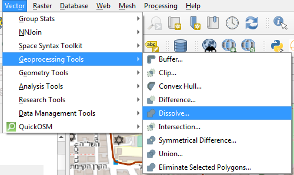

יש לספק רק שכבה ואת שם השדה עליו מבצעים את הטשטוש

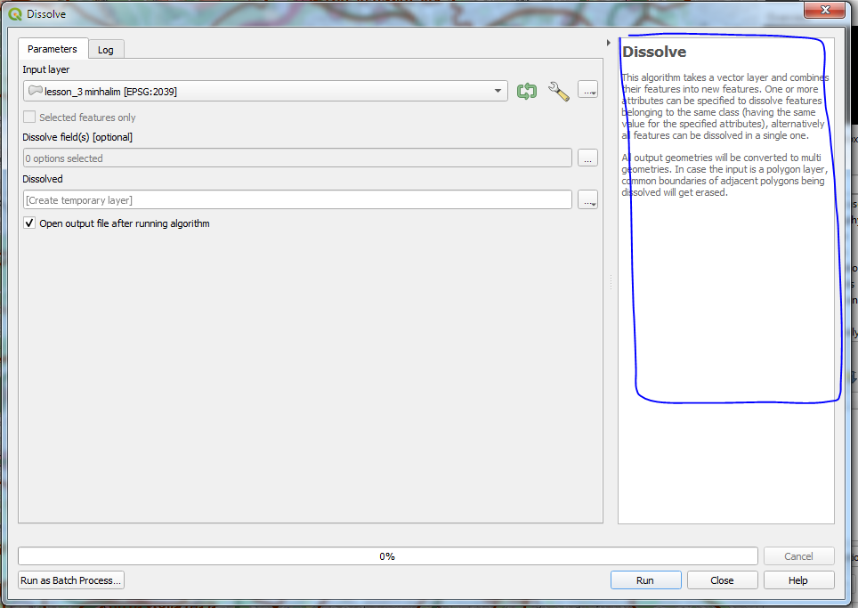

שימו לב - ניתן לקרוא הסבר על כל כלי באיזור שמסומן בכחול.

## תרגיל רביעי: פונקציות מרחביות

ייצרו את השכבות הבאות:

קווי רקל במינהלים קהילתיים

חיץ של 300 מטרים מקווי רקל

שכבה עם שלושה אזורים, לפי מגזר, במטרופולין ירושלים (למתקדמים: חפשו את delete holes לשיפור נראות התוצאה)

## אג'נדות

### למה פחות כדאי להשתמש בצורה מלוכלכת בפונקציות - נאום על תכנון בר שחזור

נלמד על מודל בילדר בהמשך הקורס

### פונקציות מרחביות למתכנני תחבורה - שיחה לתיאום ציפיות

## שיעורי בית:

ענו על השאלה הבאה:

מה אורך קווי הרק"ל המתוכננים במינהל קהילתי גוננים?

<link href="my-style.css" rel="stylesheet">
